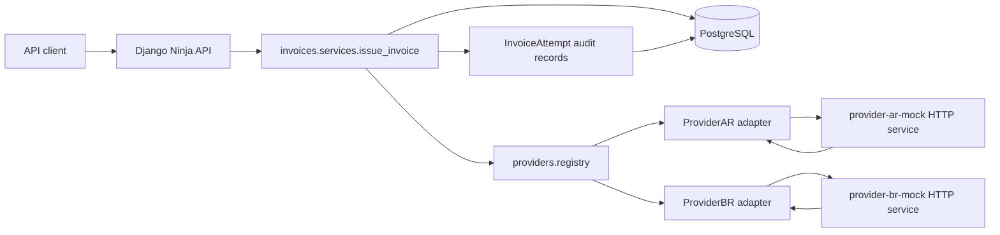

# Architecture and Technical Decisions

## Context

This service issues invoices for multiple countries. Each country is handled by a different external billing provider, with its own payload shape, response shape, timeout, and retry behavior.

The implementation keeps the Django project split into three responsibilities:

- `config`: Django settings, URL wiring, and infrastructure configuration.
- `invoices`: billing use case, persistence, idempotency, API contracts, and audit trail.
- `providers`: provider contract, provider registry, HTTP client, and provider-specific adapters.

## Architecture



Request flow:

1. `POST /invoices` receives invoice data and an `Idempotency-Key` header.
2. The API schema validates the external request.
3. The invoice service hashes the normalized request body.
4. The service selects a provider through `providers.registry` using `country_code`.
5. A new `Invoice` is created, or an existing invoice is returned when the same idempotency key and request body are repeated.
6. The selected adapter transforms the common internal request into the provider-specific payload.
7. The adapter calls the provider mock through HTTP.
8. Each attempt is recorded as an `InvoiceAttempt`.
9. The invoice is marked `issued` or `failed`, and the API returns the final result.

## Data Model and Business Rules

`Invoice` is the aggregate root for an invoice issuance request.

Key fields:

- `id`: public UUID returned as `invoice_id`.
- `entity_id`, `amount`, `currency`, `country_code`: normalized request data.
- `status`: `pending`, `issued`, or `failed`.
- `provider_code`: provider selected for the country.
- `external_reference`: identifier returned by the provider.
- `idempotency_key`: unique key used to avoid double billing.
- `request_hash`: hash of the normalized request body.
- `failure_reason`: final provider error when issuance fails.

`InvoiceAttempt` is the audit trail.

It stores:

- attempt number;
- provider used;
- payload sent to the provider;
- provider response;
- status of the attempt;
- error message;
- duration and timestamps.

Business rules:

- `Idempotency-Key` is mandatory for `POST /invoices`.
- Repeating the same key with the same request body returns the existing invoice and does not call the provider again.
- Repeating the same key with a different body returns `409 Conflict`.
- Unsupported countries return `400 Bad Request`.
- Transient provider errors and timeouts are retried with exponential backoff.
- Permanent provider errors are not retried.
- Every provider call attempt is persisted for later inspection through `GET /invoices/{invoice_id}`.

## Provider Design

Every provider adapter implements the `BillingProvider` contract:

- `build_payload(request)`: converts the internal `ProviderInvoiceRequest` into the provider-specific payload.
- `issue(payload)`: calls the provider endpoint and converts the provider response into `ProviderInvoiceResult`.

The common internal provider types live in `providers/types.py` and use Pydantic models with `frozen=True`. They are not HTTP schemas; they are internal contracts between the billing service and provider adapters. Keeping them immutable makes adapters consume data without mutating the original billing request.

Provider registration is config-driven:

```python
BILLING_PROVIDERS = [
    "providers.adapters.ar.ProviderAR",
    "providers.adapters.br.ProviderBR",
]
```

To add a new country/provider:

1. Create a new adapter class that extends `BillingProvider`.
2. Implement `build_payload` and `issue`.
3. Add the adapter dotted path to `BILLING_PROVIDERS`.
4. Add the provider endpoint to `BILLING_PROVIDER_ENDPOINTS`.
5. Add tests for payload mapping, response mapping, and failure handling.

The invoice service does not need to change.

## Provider Mocks

The provider mocks are Dockerized HTTP services in `provider_mocks/`.

Docker Compose starts:

- `provider-ar-mock`
- `provider-br-mock`

Both are built from the same image and configured with environment variables:

- `PROVIDER_COUNTRY`: `AR` or `BR`.
- `PROVIDER_CODE`: provider identifier.
- `MOCK_MODE`: `success`, `transient`, `permanent`, or `timeout`.
- `RESPONSE_DELAY_SECONDS`: optional artificial response delay.

This keeps the external-provider behavior deterministic and local. Mockaroo was intentionally not used because the challenge needs repeatable provider behavior, controlled failures, and no dependency on external services.

## API Surface

Public endpoints:

- `GET /health`
- `GET /providers`
- `POST /invoices`
- `GET /invoices/{invoice_id}`
- `GET /docs`

`POST /invoices` expects:

```json
{
  "entity_id": "customer-1",
  "amount": "1500.00",
  "currency": "ARS",
  "country_code": "AR"
}
```

Required header:

```http
Idempotency-Key: unique-request-key
```

Successful response:

```json
{
  "invoice_id": "uuid",
  "status": "issued",
  "provider_used": "provider_ar",
  "external_reference": "AR-..."
}
```

## Technical Decisions

- Django + Django Ninja: Django gives persistence, migrations, and admin-ready foundations; Ninja gives typed request/response schemas and automatic OpenAPI documentation.
- PostgreSQL in Docker: closer to production behavior than SQLite, especially for unique constraints and idempotency.
- SQLite fallback: keeps local development and tests simple when `DATABASE_URL` is not configured.
- Synchronous issuance: the challenge does not explicitly require a queue, worker, or background processing. The service issues the invoice during `POST /invoices`, which keeps the flow simple, deterministic, and easier to test. The model still includes `pending` because an invoice is created before the provider finishes; in this synchronous version that state is usually internal and short-lived. In a production version with slow providers or stricter SLAs, provider calls could move to a queue such as Celery + Redis while preserving the same invoice model, audit trail, and provider adapters.
- Header-based idempotency: avoids blocking legitimate repeated invoices with the same entity and amount.
- Provider registry: adding providers is configuration plus an adapter, not changes to the invoice service.
- HTTP provider mocks: better than in-process mocks for demonstrating payload adaptation, timeout handling, retries, and auditability.
- Standard-library HTTP client: avoids adding another dependency while the HTTP needs remain small and explicit.

## Testing Strategy

The test suite covers:

- health endpoint;
- provider listing;
- successful invoice issuance;
- invoice detail with audit trail;
- idempotent retry returning the existing invoice;
- idempotency conflict for same key with different body;
- database URL parsing;
- adapter response mapping;
- transient and permanent provider errors.

Unit and integration tests mock the HTTP boundary so they stay fast and deterministic. Docker Compose validation can be used to test the full path through PostgreSQL and the provider mock services.
